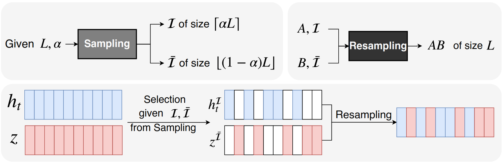
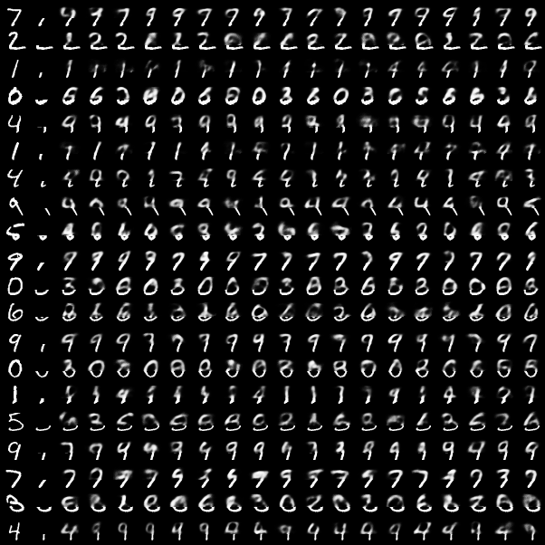

# A Tutorial on Mix-and-Match Perturbation 

Mix-and-Match implementation, based on:

Sadegh Aliakbarian, Fatemeh Saleh, Mathieu Salzmann, Lars Petersson, Stephen Gould, ["A Schotasctic Conditioning Scheme for Diverse Human Motion Prediction"](https://mix-and-match.github.io/), CVPR 2020.

***Note: This is an example of Mix-and-Match perturbation on MNIST dataset. This code contains all the building blocks of Mix-and-Match, so, it is fairly straightforward to use it in different tasks. We will soon update the code for human motion prediction.***


## Toy Example: Conditional image completion.
In this experiment, the goal is to complete MNIST digits given partial observations. Note that the conditioning signal is strong enough such that a deterministic model can generate a digit image given the condition.


## Citation
If you find this work useful in your own research, please consider citing:

```
@inproceedings{mix-and-match-perturbation,
author={Aliakbarian, Sadegh and Saleh, Fatemeh Sadat and Salzmann, Mathieu and Petersson, Lars and Gould, Stephen},
title = {A Stochastic Conditioning Scheme for Diverse Human Motion Prediction},
booktitle = {Proceedings of the IEEE international conference on computer vision},
year = {2020}
}
```

## Running the code
To train the model, run:
```
python3 train.py
```
To sample given the trained model, run:
```
python3 sample.py
```

## Tutorial: Explaining how Mix-and-Match works!



### Mix-and-Match VAE class
In this section, we explain different bits and pieces of [model.py](model.py). 

We first define the encoders and the decoder we used in this model. We have two encoders, one for the data that we one to learn the distribution of and one for the conditioning signal. Here is how we define the [data encoder](https://github.com/mix-and-match/mix-and-match-tutorial/blob/master/model.py#L17):
```
self.data_encoder = nn.Sequential(
            nn.Linear(args.input_dim, args.input_dim // 2),
            nn.BatchNorm1d(args.input_dim // 2),
            nn.ReLU(),
            nn.Linear(args.input_dim // 2, args.hidden_dim),
            nn.BatchNorm1d(args.hidden_dim),
            nn.ReLU(),
        )  
```
This is a pretty simple network (based on fully connected layers) that maps a data of `args.input_dim` dimension to `args.hidden_dim`.  Note that the [encoder for the condition](https://github.com/mix-and-match/mix-and-match-tutorial/blob/master/model.py#L27) is completely identical to this network.

Similar to any VAE/CVAE, we have two layers that computes the paramters of the approximate posterior distribution:
```
self.mean = nn.Linear(args.hidden_dim, args.latent_dim)
self.std = nn.Linear(args.hidden_dim, args.latent_dim)
```

We now define the **Sampling** operation. In the forward pass, the function gets the input data and the conditioning signal. In this [function](https://github.com/mix-and-match/mix-and-match-tutorial/blob/master/model.py#L108), we first perform the Sampling operation:
```
self.sampled_indices = list(random.sample(range(0, self.args.hidden_dim), alpha))
self.complementary_indices = [i for i in range(self.args.hidden_dim) if i not in self.sampled_indices]
```
As shown in the figure in the beginning of this notebook, the sampling operation gets a vector length hidden_dim and a sampling rate alpha, and randomly samples alpha x hidden_dim (in code, alpha is the number of indices itself, not a rate) indices. It also creates a list of complementary indices that has not been sampled. These indices are later used to condition the encoder and the decoder of the VAE.

Given the input data and the sampled indices, we [encode](https://github.com/mix-and-match/mix-and-match-tutorial/blob/master/model.py#L63) the data:
```
h = self.data_encoder(data)
sampled_data = h[:, self.sampled_indices]
complementary_data = h[:, self.complementary_indices]        
```
Note, we do exactly the same for computing a representation out of the [conditioning signal](https://github.com/mix-and-match/mix-and-match-tutorial/blob/master/model.py#L52). As can be seen, after encoding the data, we return both representation correspond to `sampled_indices` and the representation corresponds to `complementary_indices` computed in the **Sampling** step.


To [condition the encoder](https://github.com/mix-and-match/mix-and-match-tutorial/blob/master/model.py#L74), we perform Resampling as opposed to concatenation (as in standard VAE).

First, we create a new vector of size `hidden_dim = sampled_indices + complementary_indices`. This variable will contain the result of resampling operation, acting as the input to the VAE encoder.
```
fusion = torch.zeros(sampled_data.shape[0], sampled_data.shape[1] + complementary_condition.shape[1]).to(self.args.device)
```
Then, to fill in this representation, we borrow the values of the input data representation that corresponds to the sampled indices and put them in the sampled indices. Similarly, we borrow the values of the conditioning signal corresponds ot the complementary set of indices and put them in the complementary set of indices. This step is called **Resampling**.
```
fusion[:, self.sampled_indices] = sampled_data
fusion[:, self.complementary_indices] = complementary_condition
```
Then, the fusion is being fed to the VAE's encoder. That can be simply computing the approximate posterior and sampling from that using the reparametrization trick.

*Note: We do almost the same for the [Decoder](https://github.com/mix-and-match/mix-and-match-tutorial/blob/master/model.py#L95), except for the fact that we use the complementary_latent and sampled_condition. We then use the resulting representation to generate/reconstruct the data.*


We also add a [sampling function](https://github.com/mix-and-match/mix-and-match-tutorial/blob/master/model.py#L127) that can be used to sample a latent variable from the prior distribution and conditionally generate a novel data from.

### A small training script
We use the KL annealing function to compute lambda (see our paper), i.e., the weight we assign to the KL divergence term in our loss function.
```
def kl_anneal_function(anneal_function, step, k, x0):
    if anneal_function == 'logistic':
            return float(1/(1+np.exp(-k*(step-x0))))
    elif anneal_function == 'linear':
            return min(1, step/x0)
```

To train the model, we need two loss functions: the reconstruction loss and the KL divergence loss. Note that it is your choice to define a reconstruction_loss. Here, we use `BCELoss`.
```

def train(model, trainloader, alpha):
    reconstruction_loss = torch.nn.BCELoss(reduction="sum")
    optimizer = optim.Adam(model.parameters(), lr=1e-4)
    MAX_EPOCH = 50
    step = 0

    for epoch in range(1, MAX_EPOCH + 1):
        for batch_idx, (image, _) in enumerate(trainloader):
            reshaped_image = image.view(image.shape[0], -1)

            data, condition = reshaped_image[:, :500], reshaped_image[:, 500:]

            data, condition = data.to(device), condition.to(device)

            optimizer.zero_grad()
            reconstructed, mu, sigma = model(data, condition, alpha)
            # reconstruction loss
            rec_loss = reconstruction_loss(reconstructed, data)
            # KL divergence loss
            KL_loss = -0.5 * torch.sum(1 + sigma - mu.pow(2) - sigma.exp())
            # KL annealing weight
            KL_weight = kl_anneal_function('logistic', step, 0.002, 2500)
            # computing the total loss for the current mini batch
            loss = rec_loss + KL_weight * KL_loss

            loss.backward()
            optimizer.step()

            step += 1
```

## Results on conditional MNIST data generation
After training the CVAE with Mix-and-Match as the conditioning scheme, we can conditionally sample and generate new images. In the following example, the first column is the **GT**, the second column is the **Condition** (i.e., the bottom part of the image), and the next 18 columns are **completed images** generated by our CVAE.



As can be seen, almost all samples are *plausible* (given the fact that the conditioning signal is ambiguous) and *diverse*.

### Additional Notes
1. This is a very simplistic illustration of how Mix-and-Match works. For instance it doesn't contain the code for curriculum learning of perturbation.
2. In the main paper, the data and the condition are sequential data, however, in this example, these are simple vectors.
3. For any question regarding Mix-and-Match method, please contact Sadegh Aliakbarian (`sadegh.aliakbarian@anu.edu.au`)
